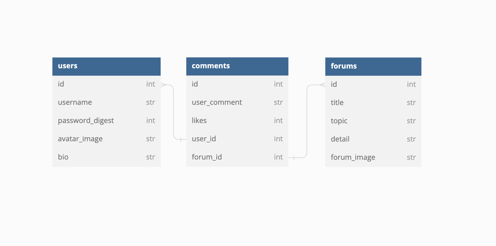

# phase-4-project-one-piece-forum

## Overview
Welcome to the One Piece Forum! In this application users can sign up and login to explore forums dedicated to One Piece topics. The application allows users to customize their personal profile, editing their about me and uploading a new avatar image. Users may create new forums and pose interesting questions they seek answers for or debate about! Finally, users may also comment on the forum, edit or delete their own comments. And afterwards, logout. 

**LINK:** https://github.com/ChristopherAPerez/phase-4-project-one-piece-forum

**LIVE LINK:** https://youtu.be/4_MRikkPdV4

### Model:



## Requirements

- Ruby 2.7.4
- NodeJS (v16), and npm
- sqlite3

### Install the Latest Ruby Version

Check your Ruby version:

```console
$ ruby -v
```

I recommend version 2.7.4, but to install:

```console
$ rvm install 2.7.4 --default
```

Also install the latest versions of `bundler` and `rails`:

```console
$ gem install bundler
$ gem install rails
```

## Setup

Start by **cloning** the project:
the remote:

```console
$ git clone git@github.com:ChristopherAPerez/phase-4-project-one-piece-forum.git
```

Then, `cd` phase-4-project-one-piece-forum:

```console
$ cd phase-4-project-one-piece-forum
```

Once inside the file, you may run:

```console
$ bundle install
```

This will allow all the necessary gemfiles to install. You may also see the gems by entering:

```console
$ gem list
```

Next:

```console
$ rails db:create
```

Next, focus on the frontend needs:

```console
$ npm install --prefix client
```

After, run the migrations and use the provided seeds.rb file to `seed` the database. This will provide data for the application.

```console
$ rails db:migrate db:seed
```

```console
$ rails db:seed
```

Finally, you can start your server with with `rails s server` in a seperate terminal.

```console
$ rails s
```

After, start the react-app, also in a seperate terminal:

```console
$ npm start — prefix client
```

And you've set up the frontend and backend for the appilcation!

## Resources

- [create-react-app][]
- [dbdiagram.io][]
- [Postman][postman download]

[create-react-app]: https://create-react-app.dev/docs/getting-started
[create repo]: https://docs.github.com/en/get-started/quickstart/create-a-repo
[dbdiagram.io]: https://dbdiagram.io/
[postman download]: https://www.postman.com/downloads/

## Authors and acknowledgment
All images used in this application belong rightfully to Official MLB and the their respectful artists.